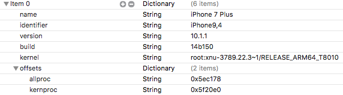

# mach_portal
Smarter version of the iOS 10.1.1 [Project Zero kernel & root exploit](https://bugs.chromium.org/p/project-zero/issues/detail?id=965#c2) by Ian Beer. Automatically matches against known device offsets. No code editing needed!

## Device Offsets
All of the known device offsets are stored in the _Device_ property list file contained in the project. Adding a new device is easy, just duplicate an existing row and fill out all the fields. A complete device will look like this:

## Contributing
If you want to add a missing device to this project, fork and submit a pull request! Also looking into making this process more reliable (>50% success rate). Don't hesitate to help! 😄 ❤️.
